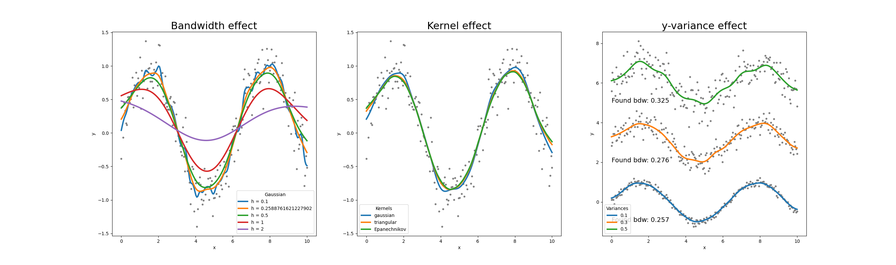

# To perform kernel smoothing


## Install
Either clone the repo, or install from git as follows:

```python
python -m pip install git+https://github.com/fredcommo/kernel_smoother.git
```

## Quick example:

```python
import numpy as np
import matplotlib.pyplot as plt
from kernel_smoother.smoother import kern_smooth

x = np.linspace(0, 10, num=200)
noise = np.random.normal(loc=0, scale=0.25, size=len(x))
y = np.sin(x) + noise

plt.scatter(x, y, s=10, c='grey')

kernels = ["gaussian", "triangular", "Epanechnikov"]
for k in kernels:
    plt.plot(x, kern_smooth(x, y, K=k), linewidth=3)
plt.xlabel('x')
plt.ylabel('y')
plt.legend(kernels, title="Kernels")
plt.show()
```

### Other possible outputs:

